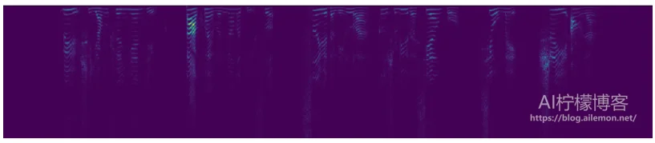
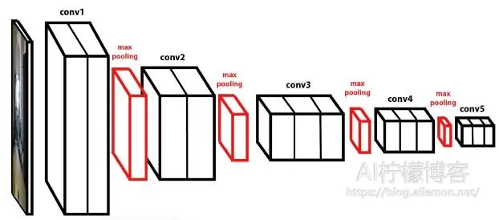
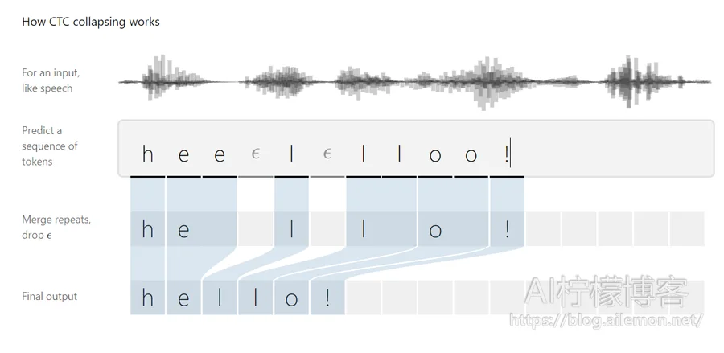
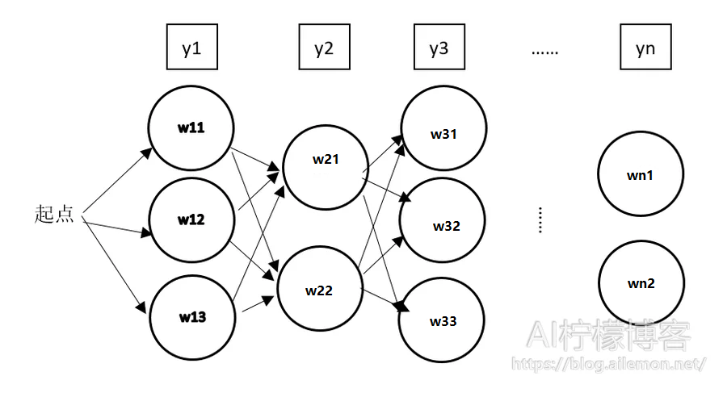
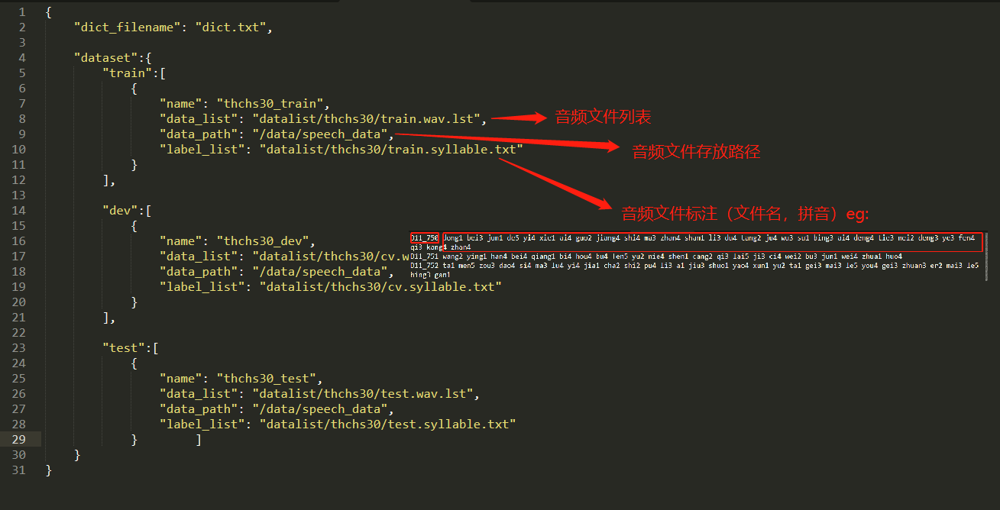

ASRT是一套基于深度学习实现的语音识别系统，全称为Auto Speech Recognition Tool，由AI柠檬博主开发并在GitHub上开源(GPL 3.0协议)。感谢AI柠檬博主，请在<https://github.com/nl8590687/ASRT_SpeechRecognition/tree/master>留下您的Star!

+ ASRT GitHub： https://github.com/nl8590687/ASRT_SpeechRecognition/tree/master
+ ASR 说明文档：https://wiki.ailemon.net/docs/asrt-doc/asrt-doc-1demhoid4inc6
+ ASR主页：https://asrt.ailemon.net/


### 1.ASRT的模型结构

近年来，深度学习在人工智能领域兴起，其对语音识别也产生了深远影响，深层的神经网络逐步替代了原来的GMM-HMM模型。在人类的交流和知识传播中，大约 70% 的信息是来自于语音。未来，语音识别将必然成为智能生活里重要的一部分，它可以为语音助手、语音输入等提供必不可少的基础，这将会成为一种新的人机交互方式。因此，我们需要让机器听懂人的声音。

ASRT语音识别系统的声学模型采用了深度全卷积神经网络，直接将**语谱图**作为输入。模型结构上，借鉴了图像识别中效果最好的网络配置VGG，这种网络模型有着很强的表达能力，可以看到非常长的历史和未来信息，相比RNN在鲁棒性上更出色。在输出端，这种模型可以和CTC方案完美结合，以实现整个模型的端到端训练，**将声音波形信号直接转录为中文普通话拼音序列**。在语言模型上，通过**最大熵隐含马尔可夫模型，将拼音序列转换为中文文本**。并且，为了通过网络提供服务给所有的用户，本项目还使用了Python的HTTP协议基础服务器包，提供基于网络HTTP协议的语音识别API，客户端软件通过网络，调用该API实现语音识别功能。

目前，该语音识别系统在考虑朝着语音识别框架方向发展，以方便研究人员随时上手研究新模型，使用新数据集等。

+ 特征提取  

将普通的wav语音信号通过分帧加窗等操作转换为神经网络需要的二维频谱图像信号，即语谱图。



+ 声学模型  

基于Keras和TensorFlow框架，使用这种参考了VGG的深层的卷积神经网络作为网络模型，并训练。



+ CTC解码

在语音识别系统的声学模型的输出中，往往包含了大量连续重复的符号，因此，我们需要将连续相同的符合合并为同一个符号，然后再去除静音分隔标记符，得到最终实际的语音拼音符号序列。




+ 语言模型

自然语言是信息的载体，记录和传播着信息，信息论之父香农对信息的定义是“信息是用于消除随机不确定性的东西”。信息通过编码，经过一定的信道传输，然后传递到接收者，再解码成对应的可被人理解感知的东西，就完成了一次信息的传递。原始人的通信方式就是说话，而说话是先将信息编码为对应的语言信号，可以是文本，可以是声音，也可以就是中文拼音，然后接收者再将收到的信号进行解码。而我们人类对自然语言的处理经历了从基于规则的算法到基于统计的算法，显然基于统计的方法比规则更有效，下面我将介绍一种基于统计的语言模型，可以实现从拼音转为文本。

拼音转汉字的算法是动态规划，跟寻找最短路径的算法基本相同。我们可以将汉语输入看成一个通信问题，每一个拼音可以对应多个汉字，而每个汉字一次只读一个音，把每一个拼音对应的字从左到右连起来，就成为了一张有向图，它被称为网格图或者篱笆图。



`y1,y2,…,yn`是输入的拼音串，`w11,w12,w13`是第一个音`y1`的候选字，`w21,w22`是`y2`对应的候选字，以此类推。整个问题就变成在有向图中寻找从起点开始，到终点概率最大的路径，我们可以使用各种最短路径算法来实现，这里我将使用维特比算法来进行语音到文本的解码。

维特比算法是先计算第一步的概率，然后将概率按大小排序，剔除掉概率过低的路径，然后再走第二步，再剔除掉概率过低的路径，以此类推。如何剔除概率过低的路径呢？我们可以设置一个阈值，比如说，设置每一步的阈值为0.001，每走一步就跟0.001的n次方相比较，小于这个阈值的全部路径都给予剔除，n为当前是第几步，可从0或者1开始，具体取决于你怎么看待第一步的初始概率。我在实现的时候，将第一步初始概率统一设置为1，所以我选择从0.001的0次方开始。这个阈值的设置，我的方法是尝试，选取一个大小最合适的。

反复执行，直到最终到达路径终点。最后，我们可以得到一个概率最大的路径，即概率最大的一个句子，在算法执行过程中，我们实际还可以得到一系列概率相对较小的路径。

零概率问题：在实际中，我们可能遇到一些词并没有在之前模型训练中加入进来，可能会遇到本来是有意义的词，由于未登录而被置为零。解决方法除了增大语料库外，还有一种方法就是，总是给未看见的词设置一个极小的概率，这样就可以缓解这个问题。但是与之带来的负面问题是因为减小了剔除的路径数，导致计算量的大大增加。

训练语料库的选取:语料库的选取，取决于目标应用场景，如果你应用与新闻，那么最好直接选取新闻语料，应用于搜索引擎，就最好直接选取普通互联网语料，如果是语音识别，那么普通人说话的场景下的语料更合适些。如果是其他方面，那么就要根据你的实际情况来判断。


### 2.自定义数据集训练ASRT

+ 数据集

这里我们以清华大学THCHS30中文语音数据集为例：



关于标注文件的生成可以通过`pinyin`库来实现，其代码样例如下：

```python
>>> from pypinyin import pinyin, lazy_pinyin, Style
>>> # 使用 5 标识轻声
>>> lazy_pinyin('衣裳', style=Style.TONE3, neutral_tone_with_five=True)
['yi1', 'shang5']
```

标注的格式为：

```
<文件标识1><空格><拼音1><空格><拼音2><空格>…<拼音3><换行符>
<文件标识2><空格><拼音1><空格><拼音2><空格>…<拼音3><换行符>
…
```

+ 修改配置文件

将`asrt_config.json`修改为如上图所示。

+ 训练代码修改

`train_speech_model.py`为训练代码，可以修改其中的超参数。

+ 环境配置并准备训练模型

```shell
#安装必要的环境
pip install -r requirements.txt -i https://mirrors.aliyun.com/pypi/simple

#训练
python train_speech_model.py
```

### 3.ASRT离线语音识别

注意ASRT基于CTC是支持流式语音识别的，这里只演示离线语音识别。

```python
python predict_speech_file.py
```

### 4.ASRT服务实现

```python
# 基于flask的http服务
python asrserver_http.py

# 基于request的post 请求
python client_http.py
```


